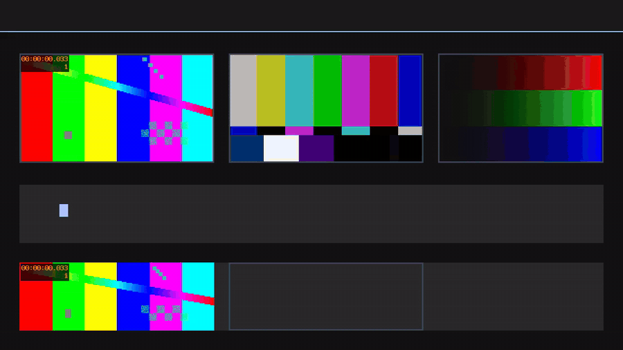

# OmniCompare（灵动对比）

[](https://github.com/ChenChen913/omnicompare/actions/workflows/ci.yml)
[](LICENSE)

OmniCompare（灵动对比）：把多个 AI 模型产出的视频、图片与 HTML 页面放进同一矩阵并行对比的对比工作台。

**简体中文** | [English](./README_EN.md)

[](docs/demo.mp4)

> 10 秒循环预览（无声）。点图看完整视频。

启动后的真实现场（本地实跑输出）：

```text
$ bun run dev

▲ Next.js 16.1.3 (Turbopack)
- Local:         http://localhost:3000
✓ Starting...
✓ Ready in 665ms
```

## 目录

- [为什么做这个项目](#为什么做这个项目)
- [功能特性](#功能特性)
- [快速开始](#快速开始)
- [用法](#用法)
- [配置](#配置)
- [部署](#部署)
- [项目结构](#项目结构)
- [开发](#开发)
- [常见问题](#常见问题)
- [已知限制](#已知限制)
- [如何贡献](#如何贡献)
- [许可证](#许可证)

## 为什么做这个项目

把同一个 Prompt 喂给多个模型之后，产出散落在各自的标签页、下载目录和聊天窗口里，横向比较只能靠来回切换窗口。OmniCompare 把这些产出收进同一个页面矩阵：视频、图片、HTML 页面各占一格，同屏播放、同屏滚动、同屏对照。

它不是视频网站，也不是文件管理器，定位是 AI 输出对比工具（AI Output Comparison Tool）。项目由前代「视频墙 Video Wall」演进而来，服务端持久化、矩阵布局、批量播放与上传链路全部继承；展示对象从视频扩展到图片与 HTML 页面之后更名为 OmniCompare。

## 功能特性

- **三类内容同矩阵**：视频（MP4 / MOV / WebM 等）、图片（PNG / JPG / GIF / WebP / SVG / BMP / AVIF）、HTML 页面；HTML 支持单文件（≤10MB）与 zip 页面包（≤50MB）。
- **矩阵可调**：内容位 1–12 个，行 × 列任意组合，可在「自动排列」与手动矩阵之间切换；导入文件数超过内容位时自动扩位。
- **多项目**：项目按「进行中 / 草稿 / 已归档」分组，内容、布局与设置互相隔离；顶栏切换，另有「库」视图总览。
- **三种导入方式**：点击空位选择、整页拖拽、一键多选。
- **批量播放控制**：同时播放 / 暂停 / 循环 / 全局静音 / 倍速。纯 HTML 项目没有播放语义，主动作自动变为「刷新全部」。
- **顶栏随内容自动适配**：导入什么内容，顶栏就长出什么控件，不需要手动选模式。
- **Studio / Focus 双模式 + 暗 / 亮双主题**。
- **安全沙箱**：HTML 与 SVG 一律经 iframe `sandbox="allow-scripts"` 与服务端 CSP 沙箱双重隔离。
- **服务端持久化**：内容与设置按项目存在服务器上，换设备打开不丢；视频流支持 HTTP Range 分段播放。

## 快速开始

前置要求：Node.js ≥ 20.9（或 Bun ≥ 1.1）。

```sh
bun install
bun run dev
```

打开 <http://localhost:3000>，把视频、图片或 HTML 文件拖进页面即可开始对比。

不想装环境时，仓库根目录的 `standalone.html` 是零依赖单页精简版：把它与 `video1.mp4` ~ `video6.mp4` 放在同一目录，用浏览器直接打开，即可得到 3 × 2 视频矩阵与同步起播。它只播放视频、标题存在浏览器本地，与主应用互不依赖。

## 用法

1. **建项目**：顶栏项目切换器里选「新建项目」；侧栏项目卡的「管理」可改名、改状态、删除（默认项目不可删）。
2. **选内容位与矩阵**：点顶栏「布局」，上半区选内容位个数（1–12），下半区选几行几列；标注「补」的矩阵不整除，末尾留空格子。
3. **导入内容**：点任意空位选文件，或把文件直接拖进页面，或点「一键导入」多选。文件多于空位时自动扩位。
4. **写标题**：每格下方可填标题（通常写模型名），失焦后自动保存，最多 100 字。
5. **对比播放**：含视频的项目点「同时播放」会把所有视频归零后一起起播；循环、静音、倍速、标题与属性显隐统一收在顶栏「显示」菜单，状态保存在服务端。
6. **调整顺序**：抓住卡片左上角的序号拖动即可重排。
7. **单卡比例**：内容信息行上的比例按钮可让某一张卡片覆盖全局比例，「跟随」表示恢复。
8. **移除**：卡片右下角垃圾桶删单个；顶栏垃圾桶清空全部（需确认，不可恢复）。

zip 页面包的要求：包内根级必须有 `index.html`，页面内请用相对路径引用资源（绝对路径 `/x` 会落到主站而不是包内），资产扩展名走白名单，解压后总量 ≤120MB、文件数 ≤300。

## 配置

服务端代码不读取任何环境变量，可配置项全部来自启动脚本与容器配置：

| 环境变量 | 必填 | 默认值 | 说明 |
|---|---|---|---|
| `PORT` | 否 | `3000` | 生产监听端口 |
| `NODE_ENV` | 否 | `production` | 由 `bun run start` 注入 |
| `HOSTNAME` | 否 | `0.0.0.0` | 容器内监听地址 |
| `TZ` | 否 | `Asia/Shanghai` | 容器时区 |
| `KEEP` | 否 | `14` | `scripts/backup-data.sh` 的备份保留份数 |
| `DEST` | 否 | `<仓库>/backups` | `scripts/backup-data.sh` 的输出目录 |

上传与容量上限写在 `src/lib/types.ts`，前后端共用同一份常量：

| 常量 | 值 | 含义 |
|---|---|---|
| `MAX_FILE_SIZE` | 200MB | 单个视频 |
| `MAX_IMAGE_SIZE` | 20MB | 单张图片 |
| `MAX_HTML_SIZE` | 10MB | 单个 HTML 文件 |
| `MAX_BUNDLE_SIZE` | 50MB | zip 页面包（压缩后） |
| `MAX_BUNDLE_UNCOMPRESSED` | 120MB | zip 页面包（解压后总量） |
| `MAX_BUNDLE_FILES` | 300 | zip 页面包内文件数 |
| `SLOT_MAX` | 12 | 内容位个数，同时也是 v2 接口的条目数上限 |

数据全部落在 `data/` 一个目录里（已 gitignore）：备份 = 复制 `data/`，迁移 = 复制后重启。也可以直接用脚本：

```sh
bash scripts/backup-data.sh          # 打包到 backups/，默认保留 14 份
KEEP=30 bash scripts/backup-data.sh  # 自定义保留份数
```

## 部署

推荐用仓库自带的 Docker 三件套，数据挂在宿主机 `./data`：

```sh
docker compose up -d --build     # 构建镜像并启动，监听 3000
docker compose logs -f
```

镜像为多阶段构建，运行时是 `node:24-slim` 加 standalone 产物，不含源码与依赖。健康检查每 30s 探测 `/api/videos`。

不用 Docker 时：

```sh
bun run build
bun run start                    # 生产模式，端口取 PORT，默认 3000
```

`bun run build` 除了 `next build`，还会把 `.next/static` 与 `public` 拷进 `.next/standalone`，并在拷贝后自检——少了这些文件，服务会返回 200 的首页却在浏览器里显示空白。

> ⚠️ **公网部署前必须自己加访问控制。** 本项目没有任何鉴权，所有访问者都能上传和删除内容。请在反向代理层加 Basic Auth、IP 白名单，或自行改造成登录制。`public/robots.txt` 因此默认 `Disallow: /`。

## 项目结构

```text
src/
├── app/
│   ├── layout.tsx                # 根布局：字体、主题 Provider、全局 Toaster
│   ├── globals.css               # 主题令牌（@theme inline）、扫描源、防抖动规则
│   ├── page.tsx                  # 首页，仅渲染 <VideoWall />
│   └── api/
│       ├── videos/               # v1 视图端点（默认项目 / ?project=id）
│       ├── projects/             # schema v2 端点（新 UI 与二次开发使用）
│       ├── files/[name]/         # 内容文件流（Range 206；HTML/SVG 强制沙箱头）
│       └── bundles/[name]/[[...path]]/  # zip 包内资产
├── components/
│   ├── video/video-wall.tsx      # 主组件：顶栏、网格、批量逻辑、多项目
│   ├── video/video-card.tsx      # 单格卡片：object-contain、拖拽上传、iframe 沙箱
│   └── ui/                       # shadcn/ui 组件（只保留实际用到的，其余用 CLI 按需添加）
└── lib/
    ├── types.ts                  # 前后端共享常量、类型与纯函数
    ├── project-store.ts          # v2 存储核心：项目锁、原子写、zip 流式解包、文件解析
    ├── video-store.ts            # v1 兼容门面
    ├── v1-project-param.ts       # v1 的 ?project= 解析
    └── v2-project-param.ts       # v2 的 [id] 解析
scripts/                          # 构建辅助、死代码扫描、测试、备份
data/                             # 运行时数据（gitignore）
standalone.html                   # 免部署单页精简版
```

架构决策、数据流、API 参考与二次开发约束见 [PROJECT.md](./PROJECT.md)；产品演进蓝图见 [docs/BLUEPRINT.md](./docs/BLUEPRINT.md)；待办与排期见 [ROADMAP.md](./ROADMAP.md)；踩坑记录见 [docs/LESSONS-LEARNED.md](./docs/LESSONS-LEARNED.md)。

## 开发

```sh
bun run dev          # 开发服务器，日志同时写终端与 dev.log
bun run typecheck    # tsc --noEmit
bun run lint         # eslint .
bun run build        # 生产构建（含 standalone 拷贝自检）

# 启动服务后跑接口回归（零外部依赖，62 项断言）
node scripts/api-regression-test.mjs

# 死代码体检：按 import 图列出不可达模块
bun run scripts/find-dead-code.mjs
```

`scripts/api-adversarial-test.sh`（v1 兼容层）与 `scripts/api-v2-smoke-test.sh`（v2）是更早的对抗测试，需要额外装 `curl`、`jq`、`python3`，缺 `jq` 会直接失败。

改动前请先读 [PROJECT.md](./PROJECT.md) §11 的「给 AI 编码助手的快速上下文」，那里列着不能违反的数据层不变量。往 `src/components/ui/` 加组件用 `npx shadcn@latest add <组件名>`（`components.json` 已配好）。

### 更新首页演示素材

README 顶部那张会动的预览图是 GIF —— GitHub 的 Markdown 渲染器会直接删掉 `<video>` / `<iframe>` 标签，**README 里没有任何办法内嵌播放 MP4**，能自己动的只有图片格式。录好新的演示视频后：

```sh
node scripts/make-demo-media.mjs 你的录制.mp4 --keep-mp4
```

它会按 GitHub 正文宽度（900px）与 12fps 转出 `docs/demo.gif`，两遍调色板保证画质，超过 8MB 会自动降规格重试；同时压一份 `docs/demo.mp4` 供「点图看完整视频」用，以及一份体积约为 GIF 一半的 `docs/demo.webp`——想改用它把 README 里的 `docs/demo.gif` 换成 `docs/demo.webp` 即可，代价是老 Safari 不显示 WebP 动画。不想要的多余产物用 `--no-webp`、`--no-poster` 关掉。

## 常见问题

**Q：`npm run dev` 报 `EADDRINUSE: address already in use :::3000`，起不来？**
A：端口被占了，多半是上一次的开发服务器没关干净（关掉终端窗口不会自动停掉它）。当前脚本会在启动前预检端口，直接告诉你**占用进程的 PID** 和三种处置方式：

```
✗ 端口 3000 已被占用，服务没能启动。
  占用它的进程 PID：34712
  三种处置方式：
    1) 关掉它（多半是上一次没关干净的开发服务器）：
         taskkill /PID 34712 /F
    2) 换个端口启动：
         set PORT=3001 && bun run dev
    3) 查看占用情况：
         netstat -ano | findstr :3000
```

**Q：`bun run dev` 起来了，但 `dev.log` 是空的？**
A：确认用的是仓库当前的 dev 脚本。它通过 `scripts/run-with-log.mjs` 双写日志；早期版本写作 `... | tee dev.log`，在 Windows 上 `tee` 不可用，日志会一直是 0 字节。

**Q：做完 `bun run build` 后启动，首页能打开但一片空白？**
A：检查 `.next/standalone/.next/static` 是否存在。构建脚本的拷贝步骤失败时会留下这种「HTML 返回 200、静态资源全部 404」的状态；当前脚本在拷贝后会自检并以非零退出码报错。

**Q：启动报 `Unable to acquire lock at .next/dev/lock`？**
A：这个项目已经有一个 dev 实例在跑（Next 的单实例锁）。关掉旧实例即可；确认没有旧实例时，删掉 `.next/dev/lock` 后重试。脚本检测到该文件时会提前提示。

**Q：上传 zip 页面包提示「根目录缺少 index.html」？**
A：入口文件必须正好在包根目录，不能在子目录里。

**Q：视频不自动播放？**
A：浏览器会拦截非静音的自动播放。项目默认全局静音，播放动作都发生在你点击之后。

**Q：想换端口？**
A：开发用 `PORT=3001 bun run dev`（脚本会明确提示"端口取自环境变量"，不会静默漂移）；生产用 `PORT=8080 bun run start`。

## 已知限制

- **无鉴权**：所有 API 没有任何认证，任何人可上传与删除。公网部署必须在反向代理层自己加访问控制。
- **互斥锁仅单进程有效**：清单读改写靠进程内 Promise 队列串行化，多实例/多机部署会破坏一致性，需要改成文件锁、Redis 锁或数据库。
- **上传不支持秒传与断点续传**：FormData 整包上传，超大视频会受服务器 body 上限约束（Next 默认无限制，反向代理常有限制，如 nginx 的 `client_max_body_size`）。
- **未做跨浏览器测试矩阵**：界面用到 `aspect-ratio`、`scrollbar-gutter`、`100dvh` 等较新的 CSS 特性，建议使用近期版本的 Chrome / Edge / Safari / Firefox。
  <!-- TODO: 需补充——给出实际验证过的浏览器与最低版本区间 -->
- **zip 包内资源走文件系统顺序读取**，没有做视频级资产的 Range 支持；包内不要塞大视频。

## 如何贡献

欢迎提 [Issue](https://github.com/ChenChen913/omnicompare/issues) 和 PR。提交前请确认：

```sh
bun run typecheck && bun run lint && bun run build
node scripts/api-regression-test.mjs
```

四件套全绿再提 PR。改动涉及清单写入、上传校验、沙箱响应头时，请一并在 PR 说明里指出对应的是 [PROJECT.md](./PROJECT.md) §4.2 的哪条不变量。

## 许可证

[MIT](LICENSE) © 2026 ChenChen913

第三方依赖（Next.js、React、Tailwind CSS、shadcn/ui 等）各自遵循其原始许可证，本项目的 MIT 许可证不改变它们的授权条款。
